# Flatpack2-CAN-ESPHome
Controller board for monitor and configure Eltek Flatpak2 HE PSU by CANBUS protocol using ESPhome.
Config for ESP32-Nodemcu-32 and ESP32-S3-Zero.
Included fonts and images for ESPHome.

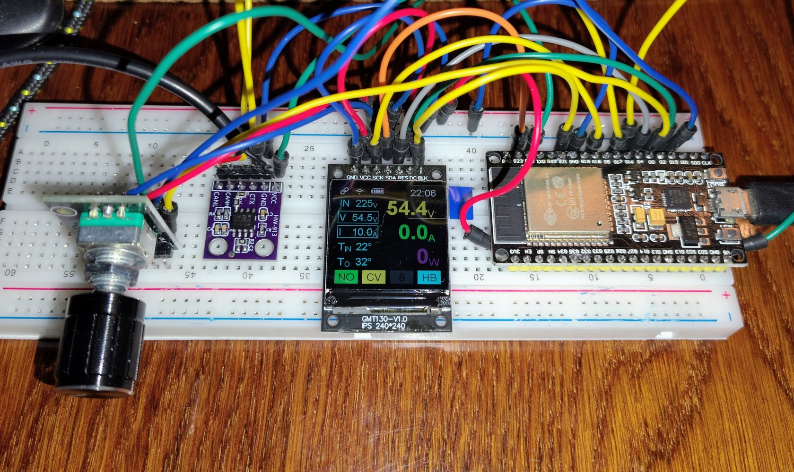

## Schematics

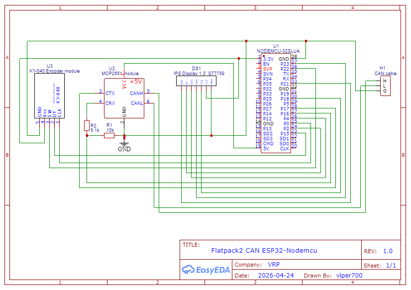

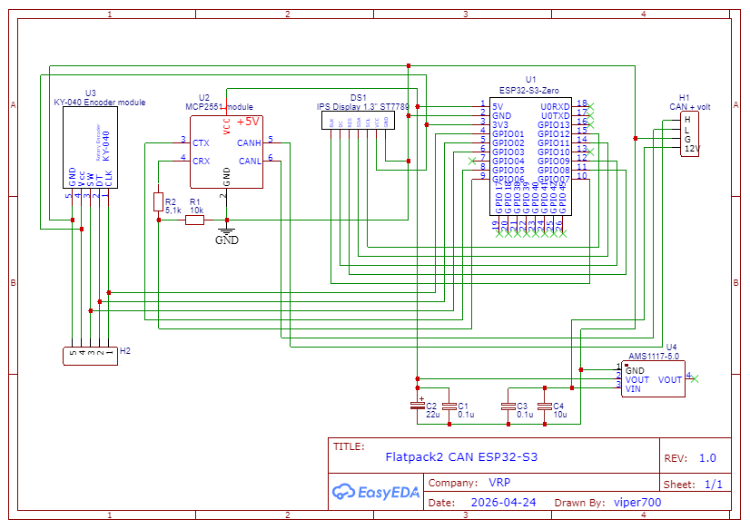

I decided to assemble it on the ESP32-S3. I designed the board and sent the order to JLCPCB.  
Here is the [Gerber](files/Gerber_Flatpack2-ESP32-S3_PCB.zip) for ordering the PCB and the [BOM](files/BOM_Flatpack2-ESP32-S3.csv) file of components.  
I received the boards from JLCPCB for this power supply.  

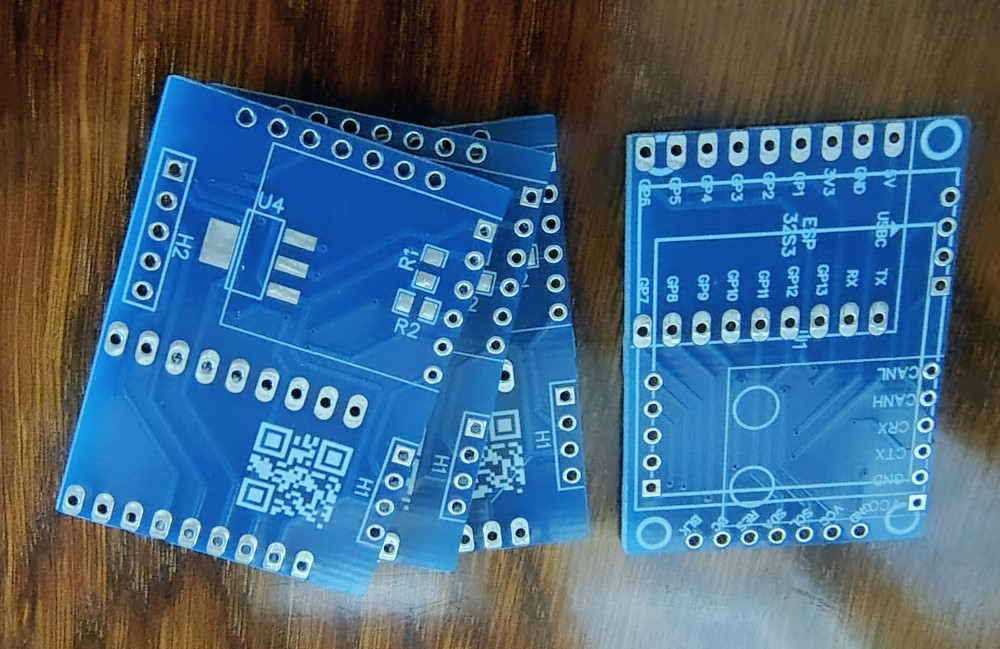

## Test printing of enclosure on a 3D printer

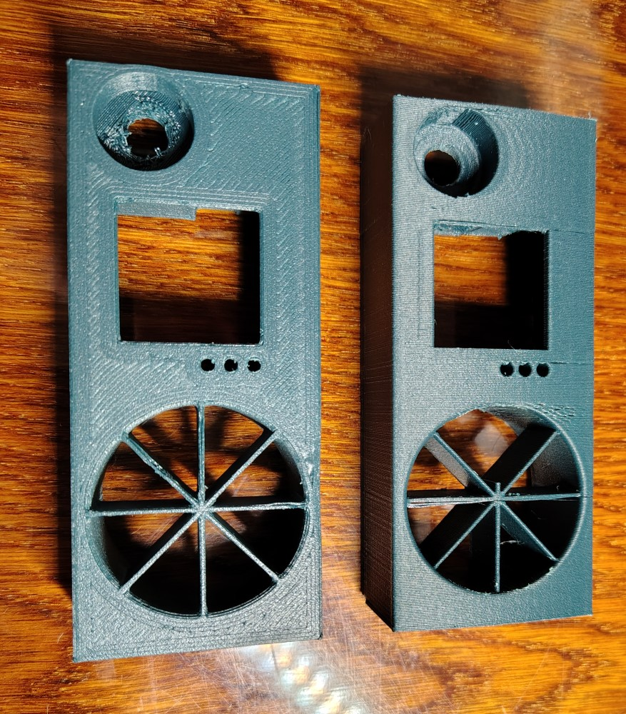

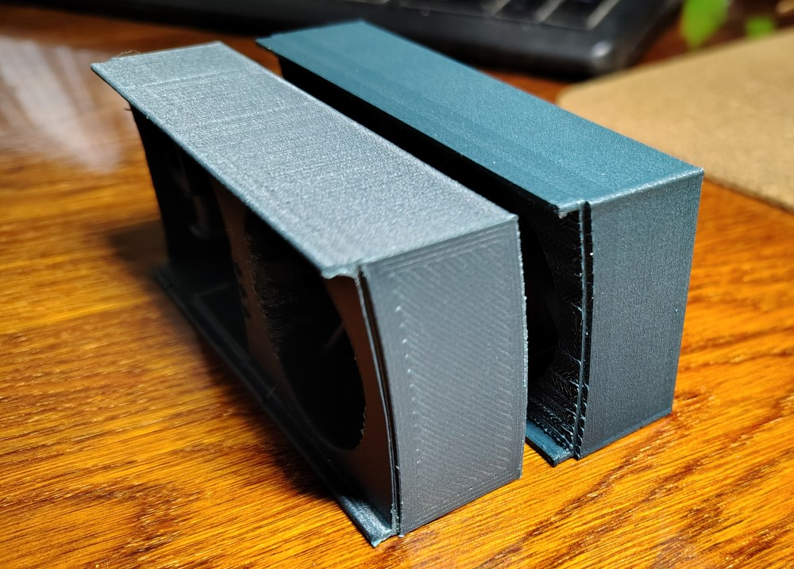

The [first enclosure](files/Flatpack2 cover_final.stl) is for vertical printing on its side. It has a rounded face.  
The [second enclosure](files/Flatpack2 cover_final_flat.stl) is for horizontal printing. Printing is much easier! Flat front side with first layer pattern.  
The [third enclosure](files/Flatpack2 cover_final_support.stl) hasn't been printed yet. It's printed at 45 degrees and has a rounded face. This should make printing easier and improve quality. Additional support is required!  

Approximate appearance

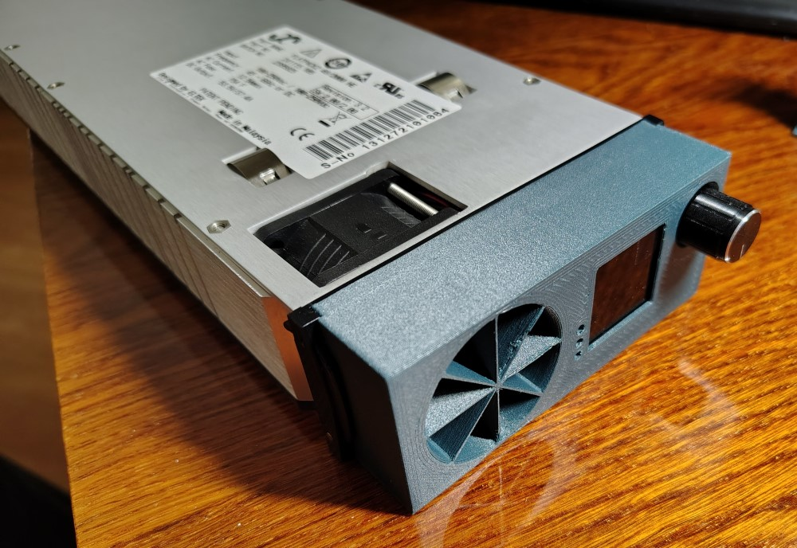

## Connecting to the power supply. 
I get 12V from the fan's power supply. There's always power there! 

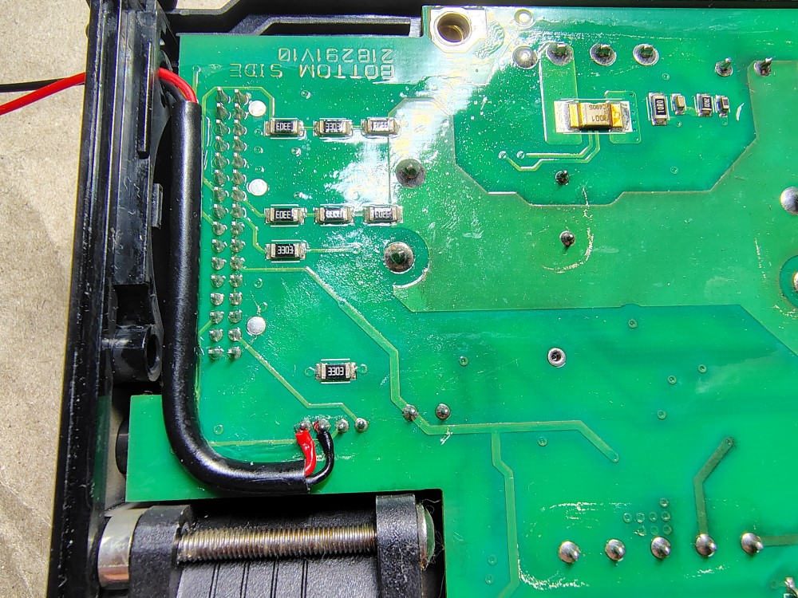

I laid the wires from the CAN and fixed them so they wouldn't dangle.
I routed all the wires to the front panel.

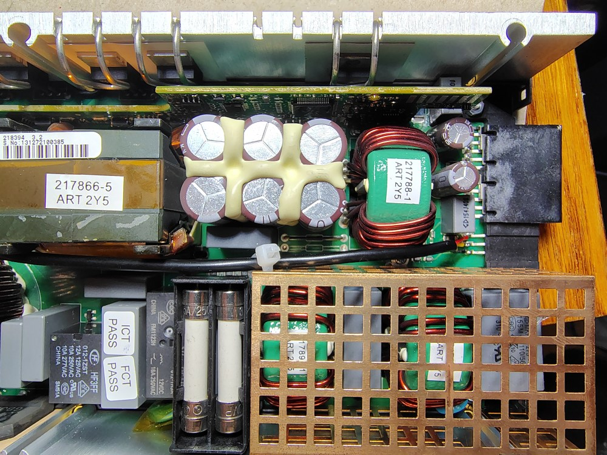

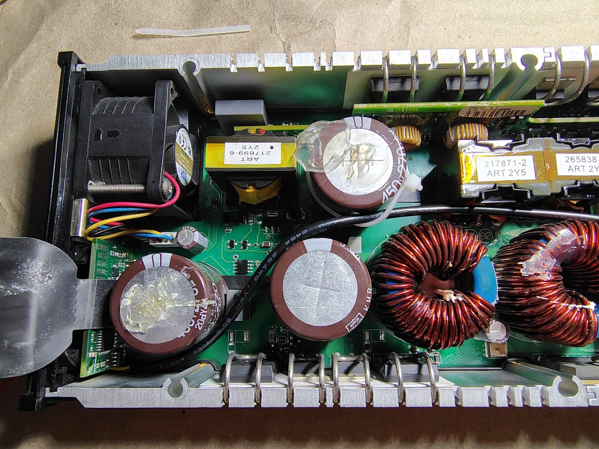

> :warning: The CAN ground and the power ground must be connected together.

## The final appearance of the device

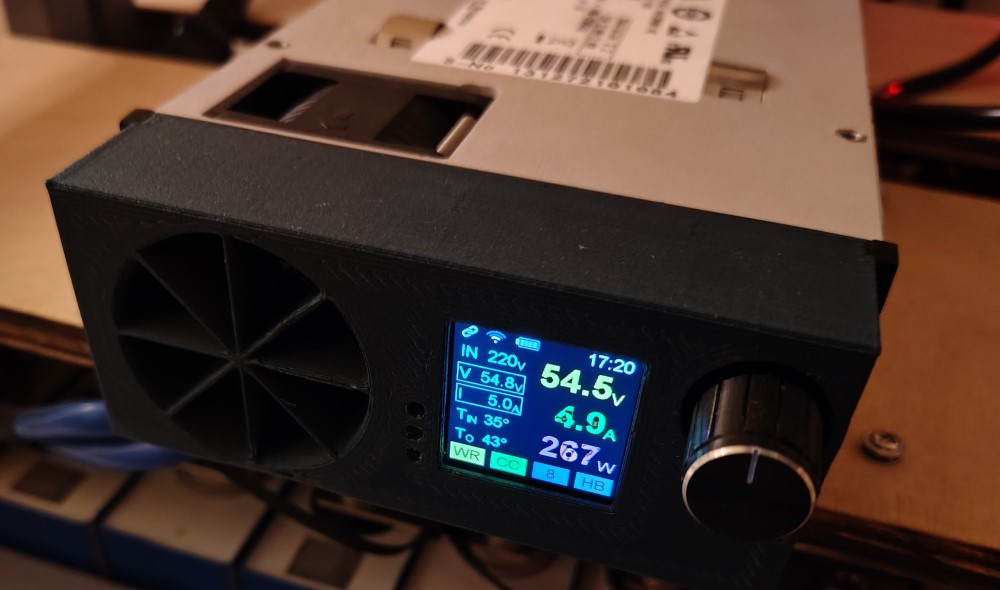

Top line: CAN connected, WiFi signal, Battery (from HA), Time (from HA)  
Bottom line: Status (Normal, Warning, Alarm), Mode (CV, CC), Brightness (1-10), Heartbeats (Every packet from CAN)  

On the left in the frame are the set values ​​of current and voltage, on the right are the actual values  

## Controls
Single press - set current. Turn the encoder. Single press - save.  
Double press - set voltage. Turn the encoder. Single press - save.  
Hold the button for 2 seconds - adjust brightness. Turn the encoder. Single press - save.  
